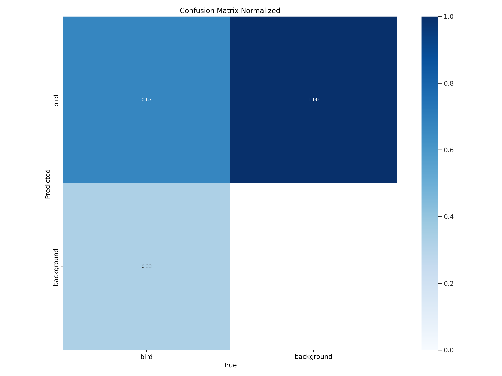

# Information what each run means

- train11 -> The model runned with gamma correction and tiling of 1280x1280
  - val2 -> The validation run of train11
    

- train6 -> The model runned with gamma correction and tiling of 1280x1280 with 1 added bird in each tile
  - train62 -> The validation run of train6
    

- train8 -> The model runned with gamma correction and tiling of 1280x1280 with 2 added birds in each tile
  - train82 -> The validation run of train8
  

- train9 -> The model runned with gamma correction and tiling of 1280x1280 with 2 added birds in each tile
    - With paramters:
        # Hyperparameters
    epochs=100,                    # Number of epochs
    batch=16,                     # batch size
    imgsz=1280,                    # Image size
    single_cls=True,
    weight_decay=0.0003,
    warmup_epochs=5.0,
    warmup_momentum=0.75,
    freeze=10,                     # Freeze first 10 layers
    patience=12,
    dropout=0.1,
    # Reproducability
    seed = 42
  - train92 -> The validation run of train9
  

- train10 -> The model run with gamma correction and tiling 640x640 with 2 added birds in each tile (Error: the birds were 5 times too large)
  - train102 -> Validation run of train10
  - The results are very bad, but that is also likely due to the size of the image. they are scaled to a size that is much too large
  - https://n0dq4k6b2w.clg07azjl.paperspacegradient.com/files/DL---detection-of-birds-in-drone-images/data/tiled_augmented_2_640_yolo_data/train/images/20240903085339_0270_D_frame_3600%20-%20kopie_tile-1.png?token=5d9556fdc3592b972cf401a71c8cb759

  

- train13 -> The model run with gamma correction and tiling 640x640 with 2 added birds in each tile (Now the birds are correct)
  - The train13 stopped halfway. So I rerun it and this becomes train14.
- train14 -> weights of train13 are used here

